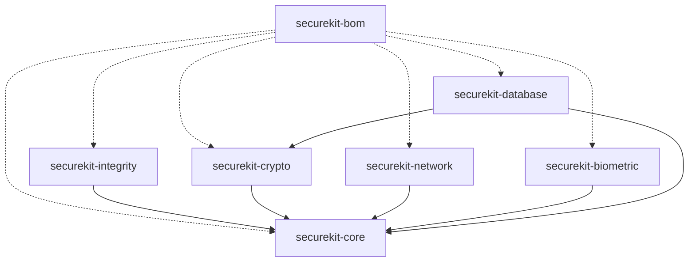

# 🛡️ SecureKit

[](LICENSE)
[](https://developer.android.com)
[]()

**SecureKit** is an enterprise-grade, defense-in-depth Android security library designed for high-risk applications (Fintech, Banking, Healthcare).

Built with modern **Kotlin** clean architecture and **C++ (NDK/JNI)** low-level system integrity checks, it strictly adheres to mobile application security standards (OWASP MASVS).

---

## 🏗️ Modular Architecture (BOM Style)

SecureKit is distributed as a modular suite governed by a **Bill of Materials (BOM)** platform catalog. You can import the BOM and select only the modules your application requires without managing individual version numbers.



| Module        | Artifact Name         | Description                                                                                             |
| ------------- | --------------------- | ------------------------------------------------------------------------------------------------------- |
| **BOM**       | `securekit-bom`       | Version catalog manager for all submodules.                                                             |
| **Core**      | `securekit-core`      | Memory-safe primitives (`SecureCharArray`), path validation, `SecureResult<T>`.                         |
| **Integrity** | `securekit-integrity` | Multi-layer Root detection, Frida/Hooking (C++ NDK), Emulator heuristics, Play Integrity API.           |
| **Crypto**    | `securekit-crypto`    | Google Tink AEAD & Streaming AEAD encrypted storage (`SecureVault`) with zero hardcoded keys.           |
| **Network**   | `securekit-network`   | Certificate Pinning factory (`OkHttpClient`) and HTTP Proxy / VPN anomaly detection (`NetworkArmor`).   |
| **Biometric** | `securekit-biometric` | `BiometricShield` wrapper, `FLAG_SECURE` screen protection, anti-tapjacking, clipboard sanitizer.       |
| **Database**  | `securekit-database`  | SQLCipher Room database encryption, Keystore-bound 256-bit passphrase manager, SQLite header inspector. |

---

## 🚀 Getting Started

### 📦 Installation

Add the BOM and selected modules to your app's `build.gradle.kts`:

```kotlin
dependencies {
    // Import SecureKit BOM platform
    implementation(platform("com.byan.securekit:securekit-bom:1.0.0"))

    // Select required modules without specifying version numbers
    implementation("com.byan.securekit:securekit-core")
    implementation("com.byan.securekit:securekit-integrity")
    implementation("com.byan.securekit:securekit-crypto")
    implementation("com.byan.securekit:securekit-network")
    implementation("com.byan.securekit:securekit-biometric")
}
```

---

## 💡 Usage Examples

### 1. Environment & Device Integrity

```kotlin
val integrityChecker = IntegrityChecker()

// Check if device is safe to execute high-risk operations
if (integrityChecker.isEnvironmentSafe(context)) {
    // Device is safe (No root, no active hooking, no emulator, no debugger, device lock enabled)
}
```

### 2. Configurable Encrypted Storage (`SecureVault`)

No hardcoded SharedPreferences names or Keystore URIs—fully configurable by the consumer:

```kotlin
val secureVault = SecureVault(
    config = CryptoConfig(
        prefsName = "MyCustomAppSecurePrefs",
        masterKeyUri = "android-keystore://my_custom_master_key_v1"
    )
)

// Encrypt & Save sensitive token
when (val result = secureVault.saveString(context, "AUTH_TOKEN", "eyJhbGciOi...")) {
    is SecureResult.Success -> Log.d("Security", "Saved securely")
    is SecureResult.Error -> Log.e("Security", "Save failed", result.cause)
}

// Retrieve & Decrypt
val token = secureVault.getString(context, "AUTH_TOKEN").getOrNull()
```

### 3. Memory-Safe String Handling (`SecureCharArray`)

Protects sensitive passwords/PINs from heap dumps:

```kotlin
val pinInput = charArrayOf('1', '2', '3', '4')
val securePin = SecureCharArray(pinInput) // 'pinInput' array is immediately zeroed out

securePin.useClearText { clearChars ->
    // Use clearChars temporarily
}
// Temporary memory buffer is automatically wiped (\u0000) after the block ends
securePin.close()
```

### 4. Network Armor & Certificate Pinning

```kotlin
val networkArmor = NetworkArmor()

// Verify no proxy or VPN interception is active
if (networkArmor.isNetworkSecure(context)) {
    val okHttpClient = networkArmor.createSecureHttpClient(
        domainName = "api.yourbank.com",
        certPins = listOf("sha256/AAAAAAAAAAAAAAAAAAAAAAAAAAAAAAAAAAAAAAAAAAA=")
    )
}
```

---

## 🛡️ Security Guarantees

- **Multi-Byte Compile-Time Obfuscation**: C++ layer uses multi-byte compile-time XOR arrays.
- **Instant Native Memory Wiping**: Native strings are zero-filled (`std::fill`) immediately after execution.
- **Non-Blocking Frida Probing**: Socket probing uses a 500ms `select()` timeout to prevent ANR.
- **Path Traversal Protection**: Canonical path validation prevents directory escape attacks.
- **R8 / ProGuard Native Consumer Rules**: Built-in consumer rules ensure smooth obfuscation in release builds.

---

## 📄 License

Licensed under the Apache License, Version 2.0. See [LICENSE](LICENSE) for details.
