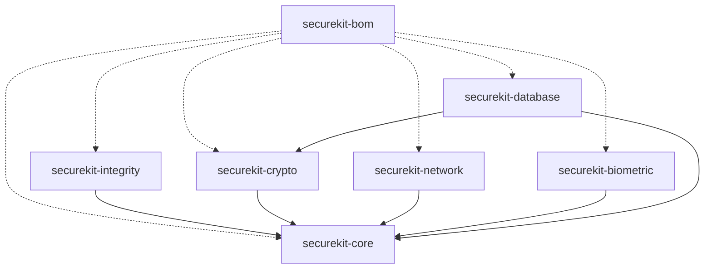

# 🛡️ SecureKit

[](https://jitpack.io/#byansanur/SecureKitWp)
[](LICENSE)
[](https://developer.android.com)
[](https://developer.android.com/about/versions/nougat)

**SecureKit** is an enterprise-grade, defense-in-depth Android security library designed for high-risk applications (Fintech, Banking, Healthcare).

Built with modern **Kotlin** clean architecture and **C++ (NDK/JNI)** low-level system integrity checks, it strictly adheres to mobile application security standards (OWASP MASVS).

---

## 🏗️ Modular Architecture (BOM Style)

SecureKit is distributed as a modular suite governed by a **Bill of Materials (BOM)** platform catalog. You can import the BOM and select only the modules your application requires without managing individual version numbers.



| Module        | Artifact Name         | Description                                                                                             |
| ------------- | --------------------- | ------------------------------------------------------------------------------------------------------- |
| **BOM**       | `securekit-bom`       | Version catalog manager for all submodules.                                                             |
| **Core**      | `securekit-core`      | Memory-safe primitives (`SecureCharArray`), path validation, `SecureResult<T>`, structured logging.     |
| **Integrity** | `securekit-integrity` | Multi-layer Root detection, Frida/Hooking (C++ NDK), Emulator heuristics, Play Integrity API.           |
| **Crypto**    | `securekit-crypto`    | Google Tink AEAD & Streaming AEAD encrypted storage (`SecureVault`) with zero hardcoded keys.           |
| **Network**   | `securekit-network`   | Certificate Pinning factory (`OkHttpClient`) and HTTP Proxy / VPN anomaly detection (`NetworkArmor`).   |
| **Biometric** | `securekit-biometric` | `BiometricShield` wrapper, `FLAG_SECURE` screen protection, anti-tapjacking, clipboard sanitizer.       |
| **Database**  | `securekit-database`  | SQLCipher Room database encryption, Keystore-bound 256-bit passphrase manager, SQLite header inspector. |

---

## 🚀 Installation

### Step 1 — Add JitPack Repository

In your **root** `settings.gradle.kts`:

```kotlin
dependencyResolutionManagement {
    repositoriesMode.set(RepositoriesMode.FAIL_ON_PROJECT_REPOS)
    repositories {
        google()
        mavenCentral()
        maven { url = uri("https://jitpack.io") }
    }
}
```

<details>
<summary>Or if you are using <code>settings.gradle</code> (Groovy)</summary>

```groovy
dependencyResolutionManagement {
    repositoriesMode.set(RepositoriesMode.FAIL_ON_PROJECT_REPOS)
    repositories {
        google()
        mavenCentral()
        maven { url 'https://jitpack.io' }
    }
}
```
</details>

### Step 2 — Add Dependencies

In your **app** `build.gradle.kts`:

```kotlin
dependencies {
    // Import SecureKit BOM — manages version for all modules
    implementation(platform("com.github.byansanur.SecureKitWp:securekit-bom:1.1.0-alpha01"))

    // Pick the modules you need (no version required when using BOM)
    implementation("com.github.byansanur.SecureKitWp:securekit-core")
    implementation("com.github.byansanur.SecureKitWp:securekit-integrity")
    implementation("com.github.byansanur.SecureKitWp:securekit-crypto")
    implementation("com.github.byansanur.SecureKitWp:securekit-network")
    implementation("com.github.byansanur.SecureKitWp:securekit-biometric")
    implementation("com.github.byansanur.SecureKitWp:securekit-database")
}
```

> **Tip:** You don't have to include every module. Only add the ones you actually need.

### Without BOM (Manual Versioning)

If you prefer not to use BOM, specify the version on each module:

```kotlin
dependencies {
    implementation("com.github.byansanur.SecureKitWp:securekit-core:1.1.0-alpha01")
    implementation("com.github.byansanur.SecureKitWp:securekit-integrity:1.1.0-alpha01")
    // ... add other modules as needed
}
```

---

## ⚙️ Initialization (Best Practice)

Initialize SecureKit once in your `Application` class. This is the **recommended** single entry point for all modules.

```kotlin
class MyApplication : Application() {

    override fun onCreate() {
        super.onCreate()

        // 1. Determine environment based on build type
        val env = if (BuildConfig.DEBUG) {
            SecurityEnvironment.DEV
        } else {
            SecurityEnvironment.PROD
        }

        // 2. Create structured file logger (auto log-rotation, environment-aware)
        val logger = FileSecurityLogger(this, env)

        // 3. Initialize SecureKit Facade
        SecureKitFacade.build(this) {
            setLogger(logger)
        }

        // 4. Load SQLCipher native libs (required only if using securekit-database)
        try {
            SecureDatabaseFactory.loadLibs()
        } catch (e: Exception) {
            logger.e("App", "Failed to load SQLCipher libs", e)
        }
    }
}
```

> **Important:** Register `MyApplication` in your `AndroidManifest.xml`:
> ```xml
> <application android:name=".MyApplication" ... />
> ```

---

## 💡 Usage Guide

### 1. Device Integrity Check

Detect root, hooking frameworks (Frida/Xposed), emulator, debugger, and more.

```kotlin
val integrityChecker = IntegrityChecker()

// Quick comprehensive check — returns true if ALL checks pass
if (integrityChecker.isEnvironmentSafe(context)) {
    // ✅ Safe to proceed with sensitive operations
    proceedWithTransaction()
} else {
    // ❌ Unsafe environment detected
    showSecurityWarning()
}
```

**Granular checks** for fine-grained control:

```kotlin
val integrityChecker = IntegrityChecker()

// Individual checks
val isRooted        = integrityChecker.isRooted()              // Root + Magisk detection (C++ NDK)
val isHooked        = integrityChecker.isHookingDetected()     // Frida, Xposed, Substrate
val isEmulator      = integrityChecker.isEmulator()            // Genymotion, Nox, BlueStacks
val isDevMode       = integrityChecker.isDeveloperModeEnabled(context)
val isAdbEnabled    = integrityChecker.isAdbEnabled(context)
val hasDeviceLock   = integrityChecker.isDeviceLockEnabled(context)

// Build a custom security policy
if (isRooted || isHooked) {
    // Block access to financial features
    blockFinancialAccess()
}

if (!hasDeviceLock) {
    // Require user to set up screen lock
    promptSetupScreenLock()
}
```

**Google Play Integrity API** (attestation token):

```kotlin
integrityChecker.requestIntegrityToken(context, nonce = "your-unique-nonce") { result ->
    when (result) {
        is SecureResult.Success -> {
            val token = result.data
            // Send token to your backend server for verification
            sendToBackend(token)
        }
        is SecureResult.Error -> {
            Log.e("Integrity", "Attestation failed", result.cause)
        }
    }
}
```

---

### 2. Encrypted Storage (`SecureVault`)

Store sensitive data (tokens, credentials) with Google Tink AES-256-GCM encryption, backed by Android Keystore.

```kotlin
// Create vault with custom config (recommended for isolation between features)
val secureVault = SecureVault(
    config = CryptoConfig(
        prefsName = "MyAppSecurePrefs",
        masterKeyUri = "android-keystore://my_app_master_key_v1"
    )
)

// ✅ Save encrypted string
when (val result = secureVault.saveString(context, "AUTH_TOKEN", "eyJhbGciOi...")) {
    is SecureResult.Success -> Log.d("Vault", "Token saved securely")
    is SecureResult.Error   -> Log.e("Vault", "Save failed", result.cause)
}

// ✅ Read & decrypt string
when (val result = secureVault.getString(context, "AUTH_TOKEN")) {
    is SecureResult.Success -> {
        val token = result.data  // Decrypted plaintext
        useToken(token)
    }
    is SecureResult.Error -> Log.e("Vault", "Read failed", result.cause)
}
```

**Encrypted File I/O** (Streaming AEAD — efficient for large files):

```kotlin
// Write encrypted file (path traversal protection built-in)
secureVault.writeFile(context, "user_document.bin", documentBytes)

// Read & decrypt file
when (val result = secureVault.readFile(context, "user_document.bin")) {
    is SecureResult.Success -> {
        val decryptedBytes = result.data
        processDocument(decryptedBytes)
    }
    is SecureResult.Error -> Log.e("Vault", "File read failed", result.cause)
}
```

---

### 3. Memory-Safe String Handling (`SecureCharArray`)

Protect passwords and PINs from heap dump analysis. The original array is immediately zeroed upon wrapping.

```kotlin
val pinInput = charArrayOf('1', '2', '3', '4')
val securePin = SecureCharArray(pinInput)
// ⚠️ pinInput is now zeroed out ['\\0','\\0','\\0','\\0']

// Temporarily access clear text in a controlled scope
securePin.useClearText { clearChars ->
    // Use clearChars for authentication
    authenticate(clearChars)
}
// Memory buffer is automatically wiped after the block ends

// Explicitly destroy when done
securePin.close()
```

---

### 4. Network Security (`NetworkArmor`)

Detect proxy/VPN interception and create certificate-pinned HTTP clients.

```kotlin
val networkArmor = NetworkArmor()

// ✅ Check if the network is safe (no proxy, no VPN)
if (networkArmor.isNetworkSecure(context)) {
    // Proceed with sensitive API calls
} else {
    Log.w("Network", "Proxy or VPN detected — potential MITM risk")
}

// Granular checks
val isProxyActive = networkArmor.isProxyActive(context)
val isVpnActive   = networkArmor.isVpnActive(context)
```

**Certificate Pinning** with OkHttp:

```kotlin
val secureClient = networkArmor.createSecureHttpClient(
    domainName = "api.yourbank.com",
    certPins = listOf(
        "sha256/AAAAAAAAAAAAAAAAAAAAAAAAAAAAAAAAAAAAAAAAAAA=",
        "sha256/BBBBBBBBBBBBBBBBBBBBBBBBBBBBBBBBBBBBBBBBBBB="  // Backup pin
    )
)

// Use this client with Retrofit or directly
val retrofit = Retrofit.Builder()
    .baseUrl("https://api.yourbank.com/")
    .client(secureClient)
    .build()
```

---

### 5. Biometric Authentication (`BiometricShield`)

Structured wrapper around AndroidX BiometricPrompt with `SecureResult` callbacks.

```kotlin
val biometricShield = BiometricShield()

// Simple biometric authentication
biometricShield.showPrompt(
    activity = this,
    title = "Authentication Required",
    subtitle = "Verify your identity to continue",
    onResult = { result ->
        when (result) {
            is SecureResult.Success -> proceedWithSensitiveAction()
            is SecureResult.Error   -> showAuthError(result.message)
        }
    }
)
```

**Crypto-bound biometric** (hardware-level key protection via TEE/StrongBox):

```kotlin
// Create a CryptoObject bound to a Keystore key
val cipher = getCryptoObjectCipher()
val cryptoObject = BiometricPrompt.CryptoObject(cipher)

biometricShield.showPromptWithCryptoObject(
    activity = this,
    title = "Secure Transaction",
    subtitle = "Authenticate to sign the transaction",
    cryptoObject = cryptoObject,
    onResult = { result ->
        when (result) {
            is SecureResult.Success -> {
                val authenticatedCrypto = result.data
                // Use the authenticated CryptoObject for signing/decryption
                signTransaction(authenticatedCrypto)
            }
            is SecureResult.Error -> handleError(result.cause)
        }
    }
)
```

---

### 6. UI Protection (`UiProtection`)

Prevent screenshots, screen recording, tapjacking, and clipboard leakage.

```kotlin
class SensitiveActivity : AppCompatActivity() {

    override fun onCreate(savedInstanceState: Bundle?) {
        super.onCreate(savedInstanceState)

        // Block screenshots and screen recording
        UiProtection.enableScreenProtection(this)

        setContentView(R.layout.activity_sensitive)

        // Prevent tapjacking on critical buttons
        val transferButton = findViewById<Button>(R.id.btn_transfer)
        UiProtection.preventTapjacking(transferButton)
    }

    override fun onPause() {
        super.onPause()
        // Clear clipboard when leaving sensitive screen
        UiProtection.clearClipboard(this)
    }
}
```

---

### 7. Encrypted Database (`securekit-database`)

SQLCipher-encrypted Room database with Keystore-bound passphrase management.

```kotlin
// 1. Get or create a 256-bit Keystore-protected passphrase
val passphraseManager = DatabasePassphraseManager()
val passphraseResult = passphraseManager.getOrCreatePassphrase(context)

when (passphraseResult) {
    is SecureResult.Success -> {
        val passphrase = passphraseResult.data

        // 2. Create SQLCipher-backed Room factory
        val factoryResult = SecureDatabaseFactory.createSupportFactory(passphrase)

        when (factoryResult) {
            is SecureResult.Success -> {
                val db = Room.databaseBuilder(context, AppDatabase::class.java, "app.db")
                    .openHelperFactory(factoryResult.data)  // 🔐 Encrypted!
                    .build()
                // Use db normally...
            }
            is SecureResult.Error -> Log.e("DB", "Factory error", factoryResult.cause)
        }

        // 3. Wipe passphrase from memory after use
        passphraseManager.wipePassphrase(passphrase)
    }
    is SecureResult.Error -> Log.e("DB", "Passphrase error", passphraseResult.cause)
}
```

**Database Integrity Check** (detect unencrypted databases):

```kotlin
val dbChecker = DatabaseIntegrityChecker()

when (val result = dbChecker.isPlaintextDatabase(context, "app.db")) {
    is SecureResult.Success -> {
        if (result.data) {
            // ⚠️ WARNING: Database is NOT encrypted!
            Log.e("Security", "Plaintext database detected — migrate to SQLCipher!")
        } else {
            Log.d("Security", "Database is properly encrypted ✅")
        }
    }
    is SecureResult.Error -> Log.e("Security", "Check failed", result.cause)
}
```

---

## 🏛️ Best Practice: MVVM Architecture

Here's the recommended architecture for integrating SecureKit into a production app:

```
app/
├── MyApplication.kt           # SecureKit initialization
├── data/
│   ├── local/
│   │   └── AppDatabase.kt     # Room + SQLCipher
│   └── repository/
│       └── SecurityRepository.kt
├── ui/
│   ├── viewmodel/
│   │   └── SecurityViewModel.kt
│   └── activity/
│       └── MainActivity.kt
```

**Repository Layer** — encapsulates all security operations:

```kotlin
class SecurityRepository(private val context: Context) {
    private val integrityChecker = IntegrityChecker()
    private val networkArmor = NetworkArmor()
    private val secureVault = SecureVault()

    suspend fun checkSecurityEnvironment() = withContext(Dispatchers.IO) {
        SecurityStatus(
            isRooted = integrityChecker.isRooted(),
            isHooked = integrityChecker.isHookingDetected(),
            isEmulator = integrityChecker.isEmulator(),
            isDevMode = integrityChecker.isDeveloperModeEnabled(context)
        )
    }

    suspend fun checkNetworkSecurity() = withContext(Dispatchers.IO) {
        NetworkStatus(
            isProxyEnabled = networkArmor.isProxyActive(context),
            isVpnEnabled = networkArmor.isVpnActive(context)
        )
    }

    suspend fun saveToken(token: String) = withContext(Dispatchers.IO) {
        secureVault.saveString(context, "user_token", token)
    }
}
```

**ViewModel Layer** — reactive UI state:

```kotlin
class SecurityViewModel(private val repository: SecurityRepository) : ViewModel() {
    private val _uiState = MutableStateFlow(SecurityUiState())
    val uiState: StateFlow<SecurityUiState> = _uiState.asStateFlow()

    fun checkSecurity() {
        viewModelScope.launch {
            _uiState.update { it.copy(isLoading = true) }

            val envStatus = repository.checkSecurityEnvironment()
            val netStatus = repository.checkNetworkSecurity()

            _uiState.update {
                it.copy(
                    isLoading = false,
                    securityStatus = envStatus,
                    networkStatus = netStatus,
                    isAppSafe = !envStatus.isRooted && !envStatus.isHooked
                )
            }
        }
    }
}
```

---

## 🔐 Security Guarantees

| Feature | Description |
|---|---|
| **C++ NDK Root Detection** | Multi-byte compile-time XOR obfuscation for root binary paths |
| **Native Memory Wiping** | `std::fill` zero-fill immediately after native string operations |
| **Non-Blocking Frida Probe** | Socket probing uses 500ms `select()` timeout to prevent ANR |
| **Path Traversal Protection** | Canonical path validation prevents directory escape attacks |
| **Keystore-Bound Encryption** | All keys managed by Android Keystore (TEE/StrongBox when available) |
| **Zero Hardcoded Secrets** | All key URIs and prefs names are configurable by the consumer |
| **ProGuard/R8 Compatible** | Built-in consumer rules ensure smooth obfuscation in release builds |

---

## 🌍 Environment Support

SecureKit supports multi-environment configurations for different stages of your development lifecycle:

| Environment | Enum Value | Logcat Output | File Logging |
|---|---|---|---|
| Development | `SecurityEnvironment.DEV` | ✅ Enabled | ✅ Enabled |
| QA Testing | `SecurityEnvironment.QA` | ✅ Enabled | ✅ Enabled |
| Penetration Testing | `SecurityEnvironment.PT` | ✅ Enabled | ✅ Enabled |
| Staging | `SecurityEnvironment.STAGING` | ✅ Enabled | ✅ Enabled |
| Production | `SecurityEnvironment.PROD` | ❌ Disabled | ✅ Enabled |

---

## 📋 Requirements

- **Min SDK**: 24 (Android 7.0 Nougat)
- **Compile SDK**: 36
- **Kotlin**: 2.1.0+
- **Java**: 21

---

## 📄 License

Licensed under the Apache License, Version 2.0. See [LICENSE](LICENSE) for details.

```
Copyright 2026 Byan

Licensed under the Apache License, Version 2.0 (the "License");
you may not use this file except in compliance with the License.
You may obtain a copy of the License at

    http://www.apache.org/licenses/LICENSE-2.0

Unless required by applicable law or agreed to in writing, software
distributed under the License is distributed on an "AS IS" BASIS,
WITHOUT WARRANTIES OR CONDITIONS OF ANY KIND, either express or implied.
See the License for the specific language governing permissions and
limitations under the License.
```
