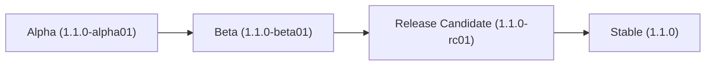

# 📌 Versioning Strategy & Release Guidelines

This document describes the versioning policy, release lifecycle, and contribution conventions for **SecureKit**.

---

## 🏷️ Semantic Versioning (SemVer)

SecureKit strictly follows [Semantic Versioning 2.0.0](https://semver.org/):

$$\text{MAJOR}.\text{MINOR}.\text{PATCH}[-\text{PRERELEASE}]$$

Example: `1.1.0-alpha01`, `1.1.0-beta01`, `1.1.0-rc01`, `1.1.0`

### Version Component Rules

* **MAJOR** (`1.0.0` $\rightarrow$ `2.0.0`): Incompatible API changes or major architectural redesigns.
* **MINOR** (`1.1.0` $\rightarrow$ `1.2.0`): New features added in a backward-compatible manner.
* **PATCH** (`1.1.0` $\rightarrow$ `1.1.1`): Backward-compatible bug fixes and security patches.
* **PRERELEASE** (`1.1.0-alpha01`): Development, testing, and release candidates prior to a stable release.

---

## 🔄 Release Lifecycle

Every feature cycle progresses through four distinct phases:



| Phase | Version Suffix | Purpose & Stability |
|---|---|---|
| **Alpha** | `-alpha01`, `-alpha02` | Active development. API signatures may change. Internal & experimental testing. |
| **Beta** | `-beta01`, `-beta02` | Feature freeze. All features implemented. Focused on bug fixing & performance. |
| **Release Candidate** | `-rc01`, `-rc02` | Production-ready candidate. Only critical showstopper fixes allowed. |
| **Stable** | *(None)* e.g., `1.1.0` | Official stable release ready for Enterprise Production environments. |

---

## 🧪 Testing Without Polluting Release Tags

During active development or build configuration testing, **do not create official Git tags**. Instead, leverage JitPack's dynamic versioning features:

### 1. Test via Short Commit Hash (Recommended)
You can consume any commit directly in your consumer project without tagging:

```kotlin
dependencies {
    implementation(platform("com.github.byansanur.SecureKitWp:securekit-bom:57f16db"))
}
```

### 2. Test via Branch Snapshot
You can target the latest build of a specific branch:

```kotlin
dependencies {
    implementation(platform("com.github.byansanur.SecureKitWp:securekit-bom:main-SNAPSHOT"))
}
```

---

## 🚀 How to Cut a New Release

When preparing an official release:

1. **Update Fallback Version**: Update fallback version strings in `build.gradle.kts` and `securekit-bom/build.gradle.kts`.
2. **Update README**: Ensure code samples reflect the new target version.
3. **Commit & Push**:
   ```bash
   git add .
   git commit -m "chore: Prepare release 1.1.0-alpha01"
   git push origin main
   ```
4. **Create & Push Git Tag**:
   ```bash
   git tag 1.1.0-alpha01
   git push origin 1.1.0-alpha01
   ```
5. **Create GitHub Release**:
   * Navigate to GitHub Releases $\rightarrow$ **Draft a new release**.
   * Select tag `1.1.0-alpha01`.
   * Title: `SecureKit 1.1.0-alpha01`.
   * Check **Set as a pre-release** (if applicable).
   * Publish release.
